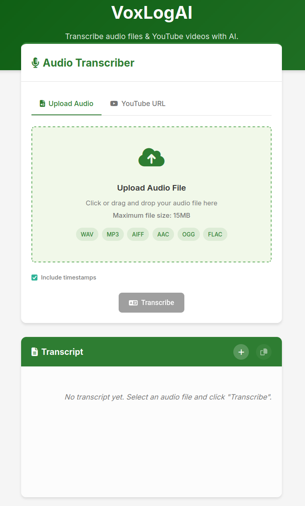
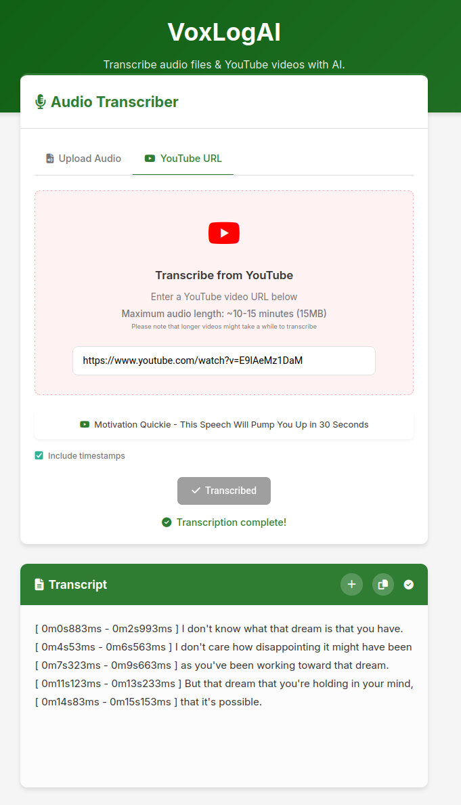

      
# VoxLogAI: AI Audio Transcription & OCR

**VoxLogAI** is an AI-powered web application designed for fast and accurate transcription of audio files and YouTube videos, as well as OCR (Optical Character Recognition) for images and PDFs, utilizing Google's powerful Gemini API. Get text from your audio and document content effortlessly.

## Try VoxLogAI Live

Access the hosted version of the application here:

[**https://voxlogai.acascais.com**](https://voxlogai.acascais.com)

## Screenshots





## Key Features

VoxLogAI offers a streamlined way to extract text from various media:

### Audio & Video
-   **Audio File Transcription:** Upload and transcribe common audio formats (WAV, MP3, AIFF, AAC, OGG, FLAC).
-   **YouTube Video Transcription:** Simply paste a YouTube URL to transcribe the video's audio content.
-   **Optional Timestamps:** Include timestamps in your transcript to easily reference specific audio segments.
-   **Max Audio Size:** Supports audio files up to 15MB (typically ~10-15 minutes, depending on quality).

### Document OCR
-   **Image Text Extraction:** Upload images (JPG, PNG, WEBP, HEIC) to extract contained text.
-   **PDF Text Extraction:** Extract text from PDF documents with advanced OCR capabilities.
-   **Max Document Size:** Supports image and PDF files up to 20MB.

### General Features
-   **AI-Powered Accuracy:** Leverages Google's advanced Gemini model for high-quality text extraction results.
-   **Privacy-Conscious:** Your files are processed and are not permanently stored on the server.
-   **User-Friendly Interface:** Clean, intuitive design with mode switching for different content types.
-   **Copy to Clipboard:** Easily copy extracted text for use in other applications.

## Getting Started (Self-Hosting)

If you wish to run your own instance of VoxLogAI:

### Prerequisites

-   Docker and Docker Compose
-   A Google Gemini API Key (You can obtain one from [Google AI Studio](https://aistudio.google.com/app/apikey))

### Setup

1.  Clone this repository:
    ```bash
    git clone https://github.com/antoniocascais/VoxLogAI.git
    cd VoxLogAI
    ```

2.  Create an environment file from the example:
    ```bash
    cp .env.example .env
    ```

3.  Edit the `.env` file and add your Google Gemini API key:
    ```ini
    GEMINI_API_KEY=your_gemini_api_key_here
    ```

### Running the Application

Start the application using Docker Compose:

```bash
docker-compose up -d
```

The application will typically be available at http://localhost:5000 (or the port mapped in your docker-compose.yml).

## Development (Without Docker)

For local development without Docker:

1.  Ensure you have Python 3.x installed.
2.  Install dependencies:
    ```bash
    pip install -r requirements.txt
    ```
3.  Make sure your `GEMINI_API_KEY` is set as an environment variable or available through the `.env` file (you might need `python-dotenv` installed and loaded in `app.py` if not already).
4.  Run the Flask application:
    ```bash
    python app.py
    ```

## Feedback, Bugs, and Feature Requests

Your feedback is valuable! If you encounter any bugs, have suggestions for improvement, or would like to request a new feature:

-   Please **[open an issue](https://github.com/antoniocascais/VoxLogAI/issues)** on the GitHub repository.

I'll review issues and consider them for future updates.

## Contact

For direct inquiries or questions not suitable for a GitHub issue, you can reach out via email:

[contact.voxlogai@acascais.com](mailto:contact.voxlogai@acascais.com)
